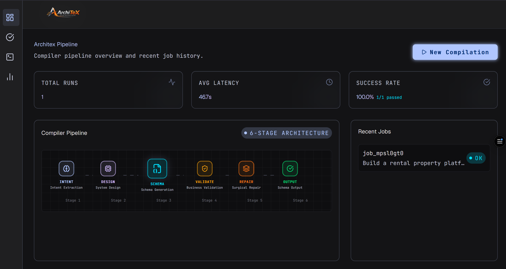
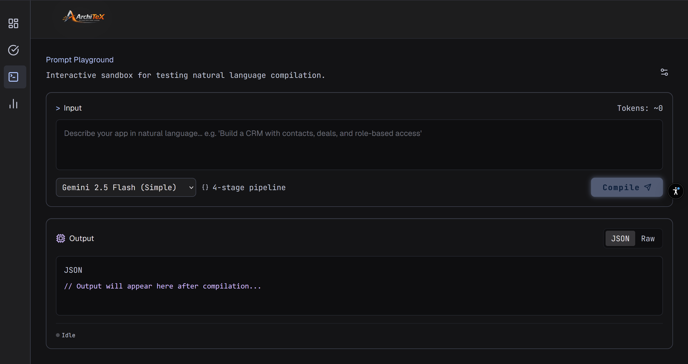
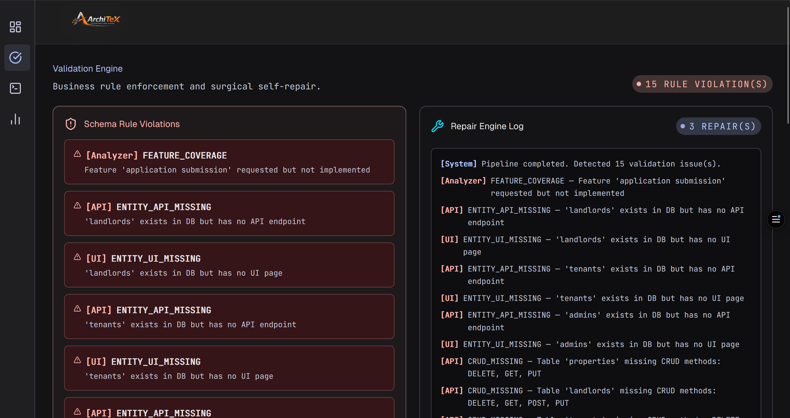
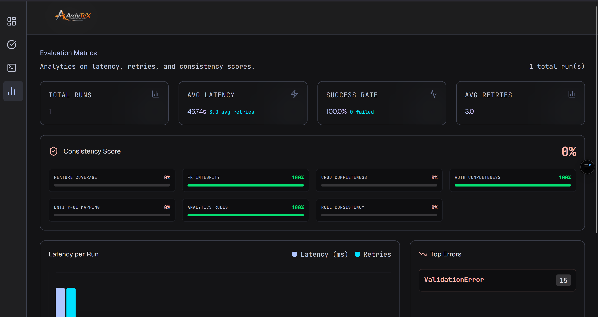

<p align="center">
  
</p>

<p align="center">
  <em>An intelligent, multi-stage compiler pipeline that transforms natural language into production-ready application configurations.</em>
</p>

<p align="center">
  <a href="https://architex-app.vercel.app">🌐 Live Demo</a> •
  <a href="https://huggingface.co/spaces/Alok8732/ArchiteX">🤗 Backend API</a> •
  <a href="#architecture">📐 Architecture</a> •
  <a href="#getting-started">🚀 Getting Started</a>
</p>

<p align="center">
  
  
  
  
  
</p>

---

## Screenshots

<table>
  <tr>
    <td width="50%">
      
      <p align="center"><strong>Dashboard</strong> — 6-stage pipeline architecture & job history</p>
    </td>
    <td width="50%">
      
      <p align="center"><strong>Playground</strong> — Real-time SSE compilation with stage tracking</p>
    </td>
  </tr>
  <tr>
    <td width="50%">
      
      <p align="center"><strong>Validation Engine</strong> — Error inspector & surgical repair log</p>
    </td>
    <td width="50%">
      
      <p align="center"><strong>Metrics</strong> — Consistency score & latency analytics</p>
    </td>
  </tr>
</table>

---

## The Problem

Large Language Models can generate code, but they consistently fail at **cross-layer structural consistency**. Ask an LLM for a full-stack app config and you'll get:

- API endpoints referencing database fields that don't exist
- UI components bound to non-existent API routes
- Auth rules granting access to pages that were never created
- Missing CRUD operations for core entities

These aren't hallucinations — they're **linker errors**. ArchiteX treats this as a compiler problem.

---

## The Solution

ArchiteX is a **4-stage compiler pipeline** that decomposes the generation task into discrete, verifiable stages — each with its own specialized LLM prompt, validation layer, and repair mechanism.

```
┌─────────────────────────────────────────────────────────────────────────┐
│                         USER PROMPT (Natural Language)                  │
└───────────────────────────────┬─────────────────────────────────────────┘
                                │
                                ▼
┌──────────────────────────────────────────────────────────────────────────┐
│  STAGE 1 — INTENT EXTRACTION (Lexer)                                    │
│  Model: Gemini 2.5 Flash Lite                                           │
│  Extracts: entities, roles, features, access_rules, assumptions         │
│  Output: IntentOutput → validated Pydantic schema                       │
└───────────────────────────────┬──────────────────────────────────────────┘
                                │
                                ▼
┌──────────────────────────────────────────────────────────────────────────┐
│  STAGE 2 — SYSTEM DESIGN (Parser)                                       │
│  Model: Gemini 2.5 Flash Lite                                           │
│  Maps: intent → pages, api_groups, db_tables, flows                     │
│  Output: DesignOutput → validated Pydantic schema                       │
└───────────────────────────────┬──────────────────────────────────────────┘
                                │
                                ▼
┌──────────────────────────────────────────────────────────────────────────┐
│  STAGE 3 — SCHEMA GENERATION (Semantic Analysis)                        │
│  Model: Gemini 3.1 Flash Lite                                           │
│  Generates: complete AppConfig (DB + API + UI + Auth layers)            │
│  Output: Raw JSON dict → validation deferred to Stage 4                 │
└───────────────────────────────┬──────────────────────────────────────────┘
                                │
                                ▼
┌──────────────────────────────────────────────────────────────────────────┐
│  STAGE 4 — VALIDATION + REPAIR (Linker)                                 │
│  Model: Gemini 3.1 Flash Lite                                           │
│  Validates: 6 structural rules (Pydantic) + 7 business rules (custom)  │
│  Repair: Up to 3 surgical LLM-powered fix iterations                   │
│  Output: AppConfig → validated, cross-referenced, production-ready      │
└──────────────────────────────────────────────────────────────────────────┘
```

---

## <a name="architecture"></a>Architecture

### Output Schema — Four Synchronized Layers

Every compilation produces an `AppConfig` with four cross-referenced layers:

| Layer | Contents | Cross-References |
|-------|----------|-------------------|
| **`db_schema`** | Tables, fields, types, PKs, FKs | FK targets must exist as `table.field` |
| **`api_schema`** | Endpoints, methods, auth, fields | Request/response fields → `db_schema` |
| **`ui_schema`** | Pages, routes, components | `bound_api` → `api_schema` endpoints |
| **`auth_rules`** | Roles, page access, endpoint access | Pages → `ui_schema`, endpoints → `api_schema` |

### Two-Tier Validation

**Structural Validators (Pydantic, always run):**

| Rule | Enforces |
|------|----------|
| R1 | API field references exist in DB schema |
| R2 | UI component `bound_api` matches an API endpoint |
| R3 | Auth `allowed_pages` match UI page names |
| R4 | Auth `allowed_endpoints` match API endpoint paths |
| R5 | Roles used in API exist in `auth_rules` |
| R6 | Role-restricted pages have `auth_required` endpoints |

**Business Validators (intent-aware, run only when relevant):**

| Validator | Triggers When | Checks |
|-----------|---------------|--------|
| Feature Coverage | Always | Every intent feature exists in the schema |
| Entity–API Coverage | Always | Every entity has API endpoints |
| Entity–UI Coverage | Always | Every entity has UI pages |
| CRUD Completeness | Always | Full CRUD ops per entity (read-only patterns exempted) |
| FK Integrity | Always | Foreign keys reference real tables and fields |
| Premium Gating | `premium`, `subscription`, `payment` detected | Premium role exists in auth rules |
| Analytics | `analytics`, `metrics`, `reports` detected | Chart components exist in UI |
| Auth Completeness | `login`, `register`, `auth` detected | Login/register endpoints + pages + auth rules |

### Surgical Repair Engine

When validation fails, the repair engine doesn't regenerate the entire schema. It:

1. Identifies exactly which rules failed and in which layer
2. Constructs a minimal repair prompt with only the errors + current config
3. Sends to the LLM for targeted fixes (max 3 iterations)
4. Re-validates after each repair cycle
5. Returns the best result with any remaining errors documented

### Dual LLM Strategy

| Stage | Primary (Gemini) | Fallback (Zhipu GLM) |
|-------|-------------------|----------------------|
| 1 — Intent | `gemini-2.5-flash-lite` | `glm-4.7-lite` |
| 2 — Design | `gemini-2.5-flash-lite` | `glm-4.7-lite` |
| 3 — Schema | `gemini-3.1-flash-lite` | `glm-4.7-lite` |
| 4 — Repair | `gemini-3.1-flash-lite` | `glm-4.7-lite` |

Lighter models for simpler extraction stages. Heavier models for schema generation and repair reasoning. Automatic fallback if primary provider fails.

---

## Tech Stack

### Backend
| Technology | Purpose |
|-----------|---------|
| **Python 3.11** | Runtime |
| **FastAPI** | Async web framework with automatic OpenAPI docs |
| **Pydantic v2** | Schema validation + cross-layer model validators |
| **Google GenAI SDK** | Gemini API client with structured JSON output |
| **OpenAI SDK** | Zhipu GLM fallback (OpenAI-compatible API) |
| **Uvicorn** | ASGI server |

### Frontend
| Technology | Purpose |
|-----------|---------|
| **React 19** | UI framework |
| **Vite 8** | Build tool with HMR |
| **Tailwind CSS v4** | Utility-first styling with custom design tokens |
| **React Router v7** | Client-side routing |
| **Lucide React** | Icon library |
| **Vercel Analytics** | Production usage tracking |

### Infrastructure
| Technology | Purpose |
|-----------|---------|
| **Docker** | Containerized builds for backend + frontend |
| **Hugging Face Spaces** | Backend deployment (Docker SDK) |
| **Vercel** | Frontend deployment with edge CDN |
| **Nginx** | Production static file serving (frontend container) |

---

## Project Structure

```
ArchiteX/
├── backend/
│   ├── app/
│   │   ├── main.py                     # FastAPI app, CORS, health check
│   │   ├── api/
│   │   │   └── routes.py               # /generate + /generate/stream endpoints
│   │   ├── core/
│   │   │   └── llm_client.py           # Gemini + Zhipu dual-LLM abstraction
│   │   ├── pipeline/
│   │   │   ├── stage1_intent.py        # NL → entities, roles, features
│   │   │   ├── stage2_design.py        # Intent → pages, APIs, tables
│   │   │   ├── stage3_schema.py        # Design → complete AppConfig JSON
│   │   │   ├── stage4_repair.py        # Validate + surgical repair loop
│   │   │   └── business_validators.py  # 7 intent-aware validation rules
│   │   ├── schemas/
│   │   │   ├── input.py                # UserPrompt model
│   │   │   ├── intermediate.py         # IntentOutput, DesignOutput models
│   │   │   └── output.py              # AppConfig + 6 structural validators
│   │   └── prompts/                    # Reserved for externalized prompts
│   ├── Dockerfile                      # Python 3.11, HF Spaces (port 7860)
│   ├── requirements.txt
│   └── .env.example                    # Environment variable template
│
├── frontend/
│   ├── src/
│   │   ├── main.jsx                    # React entry + Vercel Analytics
│   │   ├── App.jsx                     # Router configuration
│   │   ├── index.css                   # Design system tokens + global styles
│   │   ├── lib/
│   │   │   └── api.js                  # API client + SSE streaming + localStorage
│   │   ├── pages/
│   │   │   ├── Dashboard.jsx           # Pipeline visualization + recent jobs
│   │   │   ├── Playground.jsx          # Interactive compilation sandbox
│   │   │   ├── Validation.jsx          # Repair engine logs + error inspector
│   │   │   └── Metrics.jsx             # Latency, consistency, error analytics
│   │   └── components/
│   │       ├── layout/
│   │       │   ├── MainLayout.jsx      # Sidebar + header + content wrapper
│   │       │   └── Sidebar.jsx         # Responsive nav (sidebar + bottom bar)
│   │       └── ui/
│   │           ├── GlassCard.jsx       # Glassmorphism card container
│   │           ├── CodeBlock.jsx       # JSON/code display block
│   │           ├── MetricDisplay.jsx   # KPI widget with gradient text
│   │           └── StatusBadge.jsx     # Animated status pill indicator
│   ├── Dockerfile                      # Multi-stage Node + Nginx
│   ├── nginx.conf                      # SPA routing + gzip
│   └── package.json
│
├── evaluation/                         # Evaluation framework
│   ├── evaluate.py                     # Pipeline evaluation harness
│   ├── metrics.py                      # Scoring functions
│   └── datasets/                       # Test prompt datasets
│
├── docs/
│   ├── PROJECT.md                      # Detailed project document
│   └── screenshots/                    # UI screenshots
│
├── docker-compose.yml                  # Full-stack local orchestration
└── .gitignore
```

---

## <a name="getting-started"></a>Getting Started

### Prerequisites

- **Python 3.11+** and **Node.js 20+** (for local dev)
- **Docker** (for containerized setup)
- A **Google Gemini API key** ([get one here](https://aistudio.google.com/apikey))
- Optionally, a **Zhipu API key** for fallback ([zhipu.ai](https://open.bigmodel.cn/))

### Option 1 — Docker (Recommended)

```bash
# Clone the repository
git clone https://github.com/Alok943/ArchiteX.git
cd ArchiteX

# Create backend environment file
cp backend/.env.example backend/.env
# Edit backend/.env with your API keys

# Build and run
docker compose up --build -d

# Frontend → http://localhost:3000
# Backend  → http://localhost:8000/docs
```

### Option 2 — Local Development

**Backend:**
```bash
cd backend
python -m venv venv
source venv/bin/activate        # Windows: venv\Scripts\activate
pip install -r requirements.txt

# Create .env file
cp .env.example .env
# Add your GEMINI_API_KEY (required) and ZHIPU_API_KEY (optional)

uvicorn app.main:app --reload --port 8000
```

**Frontend:**
```bash
cd frontend
npm install
npm run dev
# Opens at http://localhost:5173
```

### Environment Variables

| Variable | Required | Where | Description |
|----------|----------|-------|-------------|
| `GEMINI_API_KEY` | ✅ | Backend `.env` | Google Gemini API key |
| `ZHIPU_API_KEY` | ❌ | Backend `.env` | Zhipu GLM fallback key |
| `ALLOWED_ORIGINS` | ❌ | Backend `.env` | Comma-separated CORS origins (default: `*`) |
| `VITE_API_URL` | ❌ | Frontend env / build arg | Backend API URL (default: `http://127.0.0.1:8000/api/v1`) |

---

## API Reference

### `POST /api/v1/generate`

Synchronous compilation. Returns the complete validated schema.

**Request:**
```json
{
  "prompt": "Build a task management app with teams, projects, and kanban boards. Admins can manage users."
}
```

**Response:** `200 OK` → Full `AppConfig` JSON  
**Error:** `422` → Clarification needed (prompt too vague)  
**Error:** `500` → Pipeline failure

### `POST /api/v1/generate/stream`

SSE streaming compilation with real-time stage progress.

**SSE Events:**
```
data: {"stage": 1, "name": "Intent Extraction", "status": "running", "data": {}}

data: {"stage": 1, "name": "Intent Extraction", "status": "completed", "data": {...}}

data: {"stage": "complete", "name": "Done", "status": "completed", "data": {...}, "latency_ms": 12400}
```

### `GET /health`

Returns `{"status": "ok"}`.

Full API documentation is available at `/docs` (Swagger UI) when the backend is running.

---

## Deployment

### Backend → Hugging Face Spaces

1. Create a Docker Space at [huggingface.co/new-space](https://huggingface.co/new-space)
2. Add secrets: `GEMINI_API_KEY`, `ZHIPU_API_KEY`, `ALLOWED_ORIGINS`
3. Push:
```bash
git subtree split --prefix backend -b hf-deploy
git push https://<username>:<token>@huggingface.co/spaces/<username>/ArchiteX hf-deploy:main --force
git branch -D hf-deploy
```

### Frontend → Vercel

1. Import repo at [vercel.com/new](https://vercel.com/new)
2. Set **Root Directory** → `frontend`
3. Add env var: `VITE_API_URL` = `https://<username>-architex.hf.space/api/v1`
4. Deploy

---

## Developed By

**Alok Singh**

---

<p align="center">
  <sub>Built with ❤️ using React, FastAPI, and Gemini</sub>
</p>
